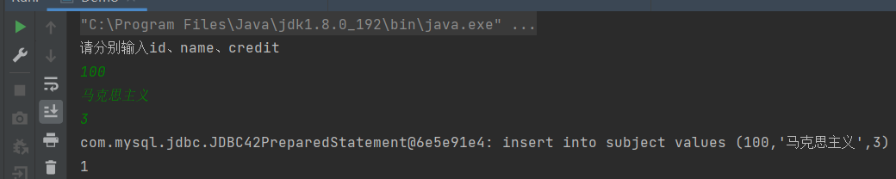
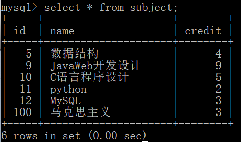
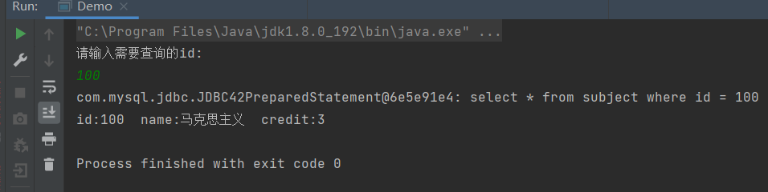

# 1. 理解JDBC

JDBC就是官方为了使我们能从容的连接市面上的数据库而设计的一组接口，我们程序员在写代码时可以使用JDBC这组接口来连接我们所需要使用的数据库。

* JDBC 的基本写法（增删改）

  ```java
          //创建数据源
          DataSource dataSource = new MysqlDataSource();
          ((MysqlDataSource)dataSource).setURL("jdbc:mysql://127.0.0.1:3306/test?characterEncoding=utf8&useSSL=false");
          ((MysqlDataSource)dataSource).setUser("root");       //mysql的用户名
          ((MysqlDataSource)dataSource).setPassword("1234");   //mysql的密码
  
          //与数据库建立连接
          Connection connection = dataSource.getConnection();
  
          //创建sql语句（增删改）在这里写 sql 语句不用写分号
          String sql = "insert into subject values (20,'SpringMVC',3)";
          //将String类型的sql转换为一条”语句对象“
          PreparedStatement statement = connection.prepareStatement(sql);
          System.out.println(statement);  //打印一下sql语句的内容
  
          //执行sql语句（增删改用Update）
          int result = statement.executeUpdate();
          System.out.println(result);     //打印一下被影响的行数
  
          //释放资源  - 先创建后释放，后创建先释放
          if(statement != null){
              statement.close();
          }
          if(connection != null){
              connection.close();
          }
  ```

  * mysql ： 想要连接的数据库。

  * 127.0.0.1：这里填写IP地址（一个主机在互联网上的地址），127.0.0.1是一个环回IP表示自己的主机，同时也可以使用  localhost  表示，两者皆可。

  * 3306：这是一个端口号，主机上每一个服务程序都对应一个端口号。（我们在安装 mysql 时默认的端口号就是 3306）。

  * test : 这里填写我们需要连接的数据库名。

  * characterEncoding=utf8 ： 这里是指定字符编码为utf8。

  * useSSL=false ： 这里指传输是否加密，false 为 否， true 为 是。

    

* JDBC 的基本写法（查）

```java
        //设置数据源
        DataSource dataSource = new MysqlDataSource();
        ((MysqlDataSource)dataSource).setURL("jdbc:mysql://127.0.0.1:3306/test?characterEncoding=utf8&useSSL=false");
        ((MysqlDataSource)dataSource).setUser("root");      //mysql用户名
        ((MysqlDataSource)dataSource).setPassword("1234");  //mysql密码

        //与数据库建立连接
        Connection connection = dataSource.getConnection();

        //创建sql语句(查) 这里写 sql 语句不用写分号
        String sql = "select * from subject";
        //装换成 语句对象
        PreparedStatement statement = connection.prepareStatement(sql);
        System.out.println(statement);      //打印一下sql语句，方便出错时排错

        //执行sql(查操作是使用Query),同时返回的是一个ResultSet类型的结果集
        ResultSet resultSet = statement.executeQuery();

        //遍历 结果集
        while(resultSet.next()){
            //可以使用字段名的方式来获取
            int id = resultSet.getInt("id");
            String name = resultSet.getString("name");
            int credit = resultSet.getInt("credit");
            //也可以使用 下标的方式来获取，注意这里的下标是从 1开始
//            int id = resultSet.getInt(1);
//            String name = resultSet.getString(2);
//            int credit = resultSet.getInt(3);

            //将每一行的内容打印出来
            System.out.println("id="+id+"  name="+name+"  credit="+credit);
        }

        //释放掉资源（先创建的后释放，后创建的先释放）
        if(resultSet != null){
            resultSet.close();
        }
        if(statement != null){
            statement.close();
        }
        if(connection != null){
            connection.close();
        }

```

------


### 有时候我们需要能够灵活的编写 SQL 语句，所以是不能将这里直接写死，接下来我们就需要使用 通配符 来进行更加灵活的 SQL 语句的编写。


- 我们从控制台进行插入数据的信息的输入。(增删改都差不多)

  ```java
          DataSource dataSource = new MysqlDataSource();
          ((MysqlDataSource)dataSource).setURL("jdbc:mysql://127.0.0.1:3306/test?characterEncoding=utf8&useSSL=false");
          ((MysqlDataSource)dataSource).setUser("root");
          ((MysqlDataSource)dataSource).setPassword("1234");
  
          Connection connection = dataSource.getConnection();
  		
  		//手动输入需要插入的信息
          Scanner sc = new Scanner(System.in);
          System.out.println("请分别输入id、name、credit");
          int id = sc.nextInt();
          String name = sc.next();
          int credit = sc.nextInt();
  		
  		//使用？通配符来占位
          String sql = "insert into subject values (?,?,?)";
          PreparedStatement statement = connection.prepareStatement(sql);
  		//具体的设置每个 ？ 所占的值。
          statement.setInt(1,id);        //注意这里的下标也是从1开始的
          statement.setString(2,name);
          statement.setInt(3,credit);
          System.out.println(statement);
  
          int result = statement.executeUpdate();
          System.out.println(result);
  
  		//释放资源
          if(statement != null){
              statement.close();
          }
          if(connection != null){
              connection.close();
          }
  
  ```

  运行结果：

  

  

  

- 通过从控制台输入 id 来查询某一条数据。

  ```java
          //设置数据源
  		DataSource dataSource = new MysqlDataSource();
          ((MysqlDataSource)dataSource).setURL("jdbc:mysql://127.0.0.1:3306/test?characterEncoding=utf8&useSSL=false");
          ((MysqlDataSource)dataSource).setUser("root");
          ((MysqlDataSource)dataSource).setPassword("1234");
  		
  		//建立连接
          Connection connection = dataSource.getConnection();
  		
  		//从控制台输入需要查询subject的id
          Scanner sc = new Scanner(System.in);
          System.out.println("请输入需要查询的id:");
          int id = sc.nextInt();
  		
  		//所需要执行的SQL语句
          String sql = "select * from subject where id = ?";
          PreparedStatement statement = connection.prepareStatement(sql);
          statement.setInt(1,id);         //动态注入id         
          System.out.println(statement);  //查看最终的sql语句，防止出错后检查
  
          ResultSet resultSet = statement.executeQuery();
          while(resultSet.next()){
              //拿到每一列的数据
              int idSubject = resultSet.getInt(1);
              String name = resultSet.getString(2);
              int credit = resultSet.getInt(3);
  			//在控制台打印出查询的结果
              System.out.println("id:"+idSubject+"  name:"+name+"  credit:"+credit);
          }
  		//释放资源（先创建的后释放）
          if(resultSet != null){
              resultSet.close();
          }
          if(statement != null){
              statement.close();
          }
          if(connection != null){
              connection.close();
          }
  ```

  结果：
  

  

  

  

  **注意：以上介绍的 JDBC 的写法是一种较为新的写法，现在也更加常见。除了这种写法外，还有一种老的写法，它是通过 反射来 设置数据源的。**

- 使用反射的版本：
  - 使用到了反射，不利于 IDEA 的解析。
  - 使用反射写出的可读性差。
  
- 不使用的版本：
  - DataSource 内置了连接池，在频繁的 **连接/断开** 过程中更加高效。
  - 代码的可读性比较好。

