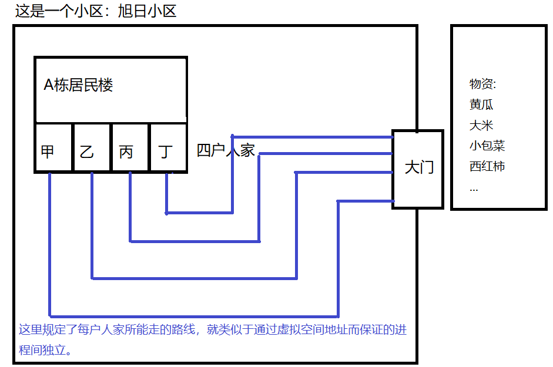
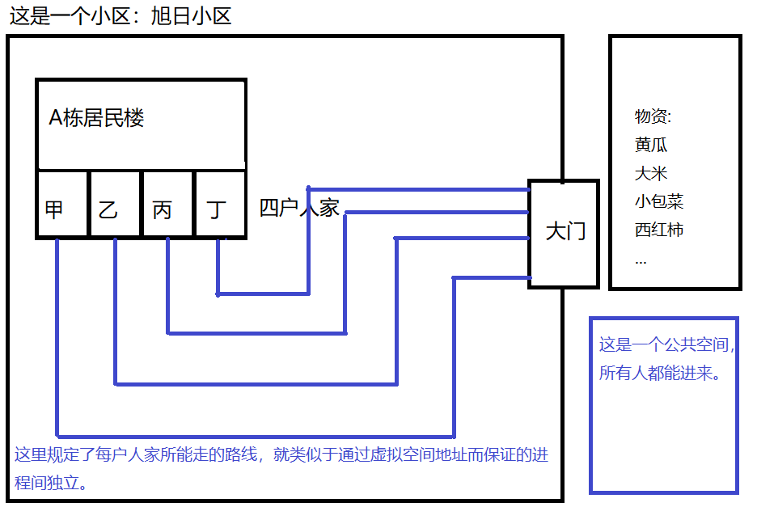

# 1.理解进程

**进程是什么？**

* 通俗的将就是“跑起来”的程序。

  * 我们的电脑上都有许多的 .exe 的可执行文件，当我们没有双击的时候，它们就只是静静的躺在那儿。如果我们双击其中的任意一个，这时 **操作系统** 就会将这个 .exe 文件加载到 **内存** 中，并让 CPU 一条一条的执行其中的指令。而这个时候，这个被双击的 .exe 文件就没有躺在那儿了，它已经开始了自己的工作。**我们称这就是一个进程！！！**

  

# 2.操作系统是如何管理进程的？

* 1. **先对一个进程进行描述**（主要是明确这个进程上有哪些属性）。

  * 由于操作系统主要是由 C/C++ 来实现的，所以它在进行 进程 描述时使用的是C语言中的结构体类型。（和 JAVA 中的类差不多，但结构体的功能更加简单）

  * 同时这个结构体也有一个名字 — 进程控制块（Process Control Block /PCB）

    

*   2.**然后对若干个进程进行组织**（主要是使用数据结构将若干进程的信息放到一起，方便增删改查）。

  * 在 **Linux** 下，使用的数据结构就是一个 **双向链表** 。它把每个 PCB 给串了起来。

  * 由于它是一个双向链表的结构，所以 **创建进程** 就是 创建出一个 PCB ，然后将 PCB 给加到双向链表中。**销毁进程** 就是将对应的 PCB 从链表中拿出来。**查看进程** 就是遍历整个链表。

    

------

# 3. PCB中有哪些属性？

**（基础属性）**

* PID：进程的标识符（id），关系就与人和身份证一样，一一对应。

* 内存指针：这个属性主要是指明进程在执行时的一些指令和数据在内存中所存放的位置。
  * 一个 .exe 可执行程序被运行时，它就会被操作系统给加载到内存中变成进程。进程想要正常执行，就需要被分配一些系统资源。
* 文件描述符表：一个进程在执行的过程中，难免需要和文件打交道。我们有知道文件是存放在硬盘上的。所以当一个进程每打开一个文件时，就会在文件描述符表上增加一项，用来记录文件的相关信息。
  * 文件描述符表可以看做一个数组，每一个元素就是一个结构体。每个结构体里面就存放了一个文件的相关信息。
  * 同时，每一个进程一启动。那它就会自动打开三个文件：**System.in(标准输入)、System.out(标准输出)、System.err(标准错误)**。
  * 文件描述符表这个数组的下标，就叫文件描述符。

**（为实现进程调度的属性）**

* 状态：字面意思就是描述了当前进程的状态是怎样的，比如 **就绪状态、阻塞状态、睡眠状态等**。

  * 就绪状态：这时代表当前进程已经做好了准备，一旦拿到 CPU 的时间片段，便会立马进入执行。
  * 阻塞状态/睡眠状态：这两个状态都是一个意思，就是当前进程即使拿到了CPU的时间片段，也是不能执行。只能让其他处于就绪状态的进程来执行。

  

* 优先级：**这个属性决定了 先给哪个进程分配时间片段，后给哪个进程分配时间片段。同时也决定了 分给谁的时间片段多，谁的少**。

  

* 记账信息：**这个属性就是为了统计一些信息，方便给进程调度提供参考**。统计的信息一般包括：哪些进程先分配的，哪些后分配的，哪些分配的多，哪些分配的少。哪些进程等待的时间长，哪些等待的时间短等信息。这样做的好处就是可以使分配变得更加合理。

  

* 上下文：这个使用游戏中的术语很好理解，存档/读档。因为一个进程拿到的时间片段大概率是不能支持当前进程执行完毕的。所以如果不记录下当前执行到的位置，就会导致出现问题。而上下文就是专门为这个服务的。**进程在被调度出CPU之前，就会将CPU中所有寄存器的数据存放到内存中，也就是对应PCB中的上下文字段里。下次再拿到时间片段，被调度上CPU时，就从内存中恢复数据到寄存器中。并接着往下执行。**

### 总结：所谓的调度，就是合理、高效的分配CPU的时间资源。— 时间管理大师

# 4. 用一个例子，更加深刻的理解进程（这里默认是一个进程里只有一个线程）的调度(准确的是说是线程的调度)。

* 小美是一个很美丽的女孩，她交了3个男朋友，分别是小张，小李和小王。

**平常的时候小张、小李和小王就处于就绪状态，随时可以和小美去约会。**

* 有一天小张因为工作原因而出差了。所以小美在小张出差的时间段里就不能和他约会。

**这时我们就称小张处于阻塞状态。**

* 后来她为了不让3个男朋友在同一时刻碰面，所以她就排了一个日程表：

  由于小美在这三个男朋友中最喜欢小王，其次比较喜欢小张，最后才是小李。

  所以她这样安排(比较喜欢的先安排)：

  * 周一 至 周二 和 小王约会。

  * 周三 至 周四 和 小张约会。

  * 周五 至 周六 和 小李约会。

**这时我们就可以说小王的优先级最高、小张其次、小李最后。**

* 后来过了一段时间，小李发现小美对他爱答不理，所以就对小美的好感度慢慢降低。这时小美也发现小李对她不够热情了。所以她对日程表有了新的安排，将小李的优先级往上提了提：
  * 周一 至 周二 和 小李约会。
  * 周三 至 周四 和 小王约会。
  * 周五 至 周六 和 小张约会。

**这时我们就可以说这是通过记账信息来调整的。**

* 小美有一次在和小张约会时，小张告诉她，他过几天就要生日了，他想要小美给她准备一件礼物，小美也欣然答应。后面小美在和小王约会时，小王又告诉小美，他邀请小美和他一起去旅游。叫小美提前准备准备，小美一听，可以免费旅游，也就开心的同意了。小美约完会回家后，以防自己忘记这些事，所以她就用了一个小本本将这些信息都记录了下来。

**这时我们就可以理解为上下文中的 存档，就跟玩游戏 存档 一样。当下一次小美和对应的男朋友约会时，她就能通过提前查看小本本，而和所对应的男朋友持续上次约会时的话题。**

------

# 5. 内存资源的分配问题？

**从上面的内容我们可以知道以下的问题：**

> 进程是什么？— 跑起来的.exe（可执行程序）。
>
> 计算机的操作系统怎样去管理进程？ — 通过 **描述、组织** 的方法进行管理。
>
> 描述是怎样操作的？ — 通过结构体的方式来明确一个进程上有哪些属性，并使它成为一个PCB（Process Control Block ）
>
> 那又如何组织？ — 在Linux下使用的是一个双向链表，将一个一个的PCB给连接起来。

> PCB 有哪些属性？
>
> * 基础属性有： **PID（进程标识符）、内存指针（指明进程执行时的一些指令和重要数据的位置）、文件描述符表（用来记录与进程打交道的文件的信息）**
> *  为实现进程调度的属性有：**状态（描述一个进程当前的状态是怎样的，比如就绪状态、阻塞状态和睡眠状态等）、优先级（描述一个进程所分配的时间资源，比如是多是少，是先分配还是后分配）、记账信息（给进程调度提供指导性的意见，比如有的进程等待的时间太长，就会对它进行优先级的调整。）、上下文（类似于游戏中的存档/读档，当进程调度下CPU时会将当前寄存器的数据存放到内存中，也就是对应PCB的上下文字段中，下次上CPU时就可以直接从内存中读取上次的数据，接着向下执行）**

**那么，每个进程的内存资源分配又是如何的呢？**

我们知道在操作系统上，同时运行着许多的进程。如果其中的某一个进程出现了问题，那么它会影响到其他的进程吗？

* 这在现在的计算机上是不存在的，因为现在的计算机借助了 **虚拟地址空间** 来保证了 **进程的独立性**。

**举个例子**

突然有一天小区出现的病例，小区被封锁了起来，每户人家只能自己去小区门口拿物资。

那么问题来了，因为小区出现了病例，所以大家并不知道还有谁被感染了。如果大家还是和往常一样自由随意的选择路线去大门，就不能保证自己经过的地方没有被感染的人走过。所以就可能会出现传染现象。

故这里就需要 **规定每户居民所走的线路** ，这样就能保证将每户人家都给隔离了出来。也就不会出现传染现象。

**(上面的每户居民就相当于一个进程，每条线路就相当于虚拟地址空间，每条路都被隔离开来，就相当于进程间独立)**

如图：

**但是我们会发现，虽然我们通过上述的操作将每户人家给独立了出来，然而有时候我们也会有特殊的情况发生，那就是如果 甲家里有西红柿，乙家里有土豆，甲想与乙交换一些土豆，乙也同意了。这时就会出现一个问题，那就是 甲和乙 的线路是隔离开的，他们不能见面。（这种情况在进程中也会出现，有时候进程和进程之间也是需要打交道的，并不是完全隔离开的。）**

那么如何解决？

如图：

> 如上图所示，设立一个公共空间，这时 甲 就可以拿着 西红柿 去到公共空间，将西红柿放在那儿自己回来，然后经过消毒杀菌。接着 乙 再去到公共空间拿走西红柿，并将土豆放在那儿。最后甲再来那土豆。这样就交换完毕了。
>
> **同理，在计算机中也是如此，也是会有一个公共空间来帮助进程与进程之间进行通讯。**

**总结以上所回答的问题：**

* 进程是啥？
* 操作系统是如何管理进程的？
* PCB中有哪些属性？
* 进程的调度是怎么回事？
* 进程的独立性是怎么回事？
* 进程之间是怎样通讯的？

****

# 6. 理解线程

**线程是什么？**

> 举个例子：
>
> 进程就好比一个工厂，在这个工厂里有许多的生产线，而每一条生产线就是一个线程。
>
> 总结：一个进程里有一个或多个线程。

**为什么要有线程？**

> 因为我们现在的操作系统是多任务的，所以我们程序员也就需要 **"并发编程"**

**进程不能实现"并发编程"吗？**

> 进程可以实现"并发编程"，但有一些问题：
>
> * 1. 因为创建进程是需要分配内存和资源的，所以频繁的创建/销毁进程，就会使效率很低，成本较高。
>   2. 同时进程的调度也是一个效率低，成本高的事情。
>
> **怎么解决这个问题？**
>
> * 1. 使用进程池。虽然解决了频繁创建/销毁进程的问题，但是如果在一些任务少的时候，**进程池里的一些进程被闲置在那儿，就会空耗系统的资源**。显然这个解决办法不太好！
>   2. 使用线程实现"并发编程"。

**线程实现"并发编程"的特点？**

> 在上面说过了，线程是在进程里的，同时一个进程里可以有一个或多个线程。而操作系统是以进程为单位来进行 内存和资源 的分配的，也就是说一个进程里的多个线程共享一块空间和同一份资源。换而言之就是只在第一次创建线程时，需要进行内存和资源的分配。而后序在同一个进程里创建线程时，都是不需要进行资源的分配的。这也就大大节省了成本，提高了效率。在Linux上把进程也称为轻量级线程。

**进程与线程之间的联系**？

* 1. 线程是包含在进程里面的，一个进程里可以有一个或多个线程。
* 2. 进程和线程都能实现"并发编程"，但是线程比进程更加轻量。原因：线程只有在创建第一个的时候需要进行内存和资源的分配。进程则是需要每一个都创建/销毁资源。
* 3. 操作系统是按照进程来进行内存和资源的分配的，而创建的线程需要在CPU上进行调度执行，所以可以说线程就是操作系统调度执行的基本单位。

* 4. 进程与进程之间是相互独立的，其中一个进程挂了，也不会影响到其他的进程。而在同一个进程中多个线程，如果其中的一个线程挂了，就会对当前进程内的其他线程产生影响。